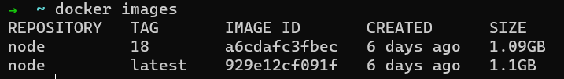

# Curso Docker

Created: June 21, 2023 5:17 PM

<details>
<summary><b> Por qué aprender DOCKER?</b></summary>
    
Aprender Docker puede ser beneficioso por varias razones:

1. Gestión de entornos de desarrollo: Docker facilita la creación y gestión de entornos de desarrollo reproducibles. Permite empaquetar una aplicación y todas sus dependencias en un contenedor, lo que garantiza que la aplicación se ejecute de la misma manera en cualquier entorno que tenga Docker instalado.
2. Portabilidad y escalabilidad: Docker permite crear contenedores ligeros y portátiles que se pueden ejecutar en cualquier máquina que tenga Docker instalado, independientemente del sistema operativo o la configuración del hardware. Esto facilita la migración de aplicaciones entre diferentes entornos y la escalabilidad horizontal al ejecutar múltiples contenedores en clústeres de servidores.
3. Eficiencia y aislamiento: Los contenedores Docker utilizan recursos del sistema de manera eficiente, ya que comparten el mismo kernel del sistema operativo subyacente. Además, los contenedores proporcionan aislamiento, lo que significa que las aplicaciones empaquetadas en contenedores no se ven afectadas por otras aplicaciones que se ejecutan en la misma máquina.
4. Despliegue rápido y simplificado: Docker simplifica el proceso de implementación de aplicaciones. Al empaquetar una aplicación y sus dependencias en un contenedor, se eliminan las posibles inconsistencias entre los entornos de desarrollo y producción. Además, Docker facilita la orquestación y el despliegue de aplicaciones en clústeres de contenedores utilizando herramientas como Docker Compose o Kubernetes.
5. Comunidad y ecosistema: Docker cuenta con una gran comunidad de desarrolladores y una amplia variedad de imágenes de contenedores preconstruidas disponibles en Docker Hub. Esto significa que puedes aprovechar y compartir fácilmente aplicaciones y servicios creados por otros desarrolladores.
</details>
<details>
<summary><b>Conceptos clave:</b></summary>

1. Contenedor: Un contenedor es una unidad de software liviana y autónoma que contiene una aplicación y todas sus dependencias, como bibliotecas, herramientas y archivos de configuración. Los contenedores se ejecutan de manera aislada en el sistema operativo subyacente y ofrecen portabilidad y consistencia en diferentes entornos.
    
    Los contenedores pueden contener archivos: HTML, NodeJs, .env
    
    Son portables, lo que los hace fáciles de compartir, entre desarroladores y realizar operaciones.
    
    Lo que permite hacer despliegue y desarrollo más fácil.
    
    Los contenedores se almacenan en un repositorio de contenedores, existen repositorios privados y públicos, dentro de los públicos encontramos el Docker Hub
    
2. Imagen: Una imagen es un archivo estático y sin cambios que contiene todas las instrucciones necesarias para crear un contenedor. Puedes pensar en una imagen como una plantilla o un plano de construcción para un contenedor. Las imágenes se utilizan para crear y ejecutar contenedores.
3. Dockerfile: Un Dockerfile es un archivo de texto que contiene las instrucciones para construir una imagen de Docker. En él, puedes especificar qué sistema operativo base utilizar, qué dependencias instalar y cómo configurar el entorno dentro del contenedor.
4. Registro de Docker (Docker Registry): Un registro de Docker es un repositorio en línea donde puedes almacenar y compartir imágenes de Docker. El registro de Docker más conocido es Docker Hub. Puedes encontrar imágenes creadas por otras personas y también puedes enviar tus propias imágenes al registro para compartirlas.
5. Docker Compose: Docker Compose es una herramienta que te permite definir y administrar aplicaciones multi-contenedor. Con Docker Compose, puedes utilizar un archivo YAML para especificar la configuración de varios contenedores, sus relaciones y las redes en las que se comunican. Esto facilita el despliegue y la gestión de aplicaciones compuestas por varios servicios.
</details>
<details>
<summary><b>Virtualización: Docker Vs VM</b></summary>
<details>
<summary><b>Docker Vs VM</b></summary>
Docker y las máquinas virtuales (VM) son dos tecnologías de virtualización que tienen enfoques ligeramente diferentes. Aquí te explico las principales diferencias entre Docker y las VM:

1. Aislamiento: En las VM, cada máquina virtual se ejecuta con su propio sistema operativo completo y tiene acceso a los recursos de hardware asignados, lo que proporciona un alto nivel de aislamiento entre las VM. Por otro lado, Docker utiliza un enfoque de virtualización a nivel de sistema operativo, donde los contenedores comparten el mismo kernel del sistema operativo subyacente. Esto permite un aislamiento más ligero y eficiente, ya que no es necesario ejecutar múltiples sistemas operativos completos.
2. Uso de recursos: Las VM requieren recursos significativos, como memoria y espacio en disco, para ejecutar múltiples sistemas operativos completos. Cada VM también consume parte de la capacidad de procesamiento de la CPU. En contraste, Docker es más ligero en términos de recursos, ya que utiliza el mismo kernel del sistema operativo y comparte bibliotecas y archivos del sistema con el host. Esto permite ejecutar múltiples contenedores en un solo sistema, utilizando menos recursos en comparación con las VM.
3. Tiempo de inicio: Las VM suelen tener un tiempo de inicio más largo debido a la necesidad de iniciar y cargar un sistema operativo completo. En cambio, los contenedores de Docker se inician rápidamente, ya que solo necesitan cargar las dependencias específicas de la aplicación contenida en el contenedor.
4. Portabilidad: Docker se destaca en términos de portabilidad. Los contenedores de Docker se pueden ejecutar en cualquier sistema que tenga Docker instalado, independientemente del sistema operativo subyacente. Esto facilita la migración de aplicaciones entre diferentes entornos. Por otro lado, las VM suelen ser más dependientes del sistema operativo y requieren una configuración y adaptación más específicas para cada entorno.
5. Administración: Administrar VM implica mantener y administrar múltiples sistemas operativos y aplicaciones, lo que puede requerir más esfuerzo en términos de mantenimiento y actualizaciones. Docker simplifica la gestión y el despliegue de aplicaciones al proporcionar herramientas como Docker Compose y Docker Swarm para orquestar y escalar contenedores.

En resumen, Docker se enfoca en la virtualización a nivel de sistema operativo y proporciona una forma liviana y portátil de empaquetar aplicaciones y sus dependencias, mientras que las máquinas virtuales ofrecen un mayor nivel de aislamiento y permiten ejecutar múltiples sistemas operativos completos en un solo servidor. La elección entre Docker y VM depende de las necesidades específicas de tu caso de uso, considerando factores como el rendimiento, los recursos disponibles y los requisitos de aislamiento.
</details>    
<details>
<summary><b>Tipos de virtualización</b></summary>    

Existen varios tipos de virtualización, cada uno con su propio enfoque y casos de uso específicos. Aquí te presento algunos de los tipos más comunes de virtualización:

1. Virtualización de hardware (Hypervisor): También conocida como virtualización de nivel de servidor, es uno de los tipos más comunes de virtualización. Utiliza un software llamado hypervisor o monitor de máquina virtual para crear y administrar múltiples máquinas virtuales en un servidor físico. El hypervisor se ejecuta directamente en el hardware y permite que cada máquina virtual tenga su propio sistema operativo y recursos asignados.
2. Virtualización de sistema operativo (Containers): Este tipo de virtualización se basa en la virtualización a nivel de sistema operativo. En lugar de crear múltiples sistemas operativos completos, se crean contenedores ligeros que comparten el mismo kernel del sistema operativo subyacente. Los contenedores proporcionan un entorno aislado para las aplicaciones y sus dependencias, pero son más eficientes en términos de recursos y tiempo de inicio en comparación con las máquinas virtuales.
3. Virtualización de red: Este tipo de virtualización se utiliza para crear redes virtuales que operan dentro de una infraestructura física de red. Permite que múltiples redes lógicas coexistan en una misma infraestructura física, lo que facilita la segmentación y la gestión de redes en entornos empresariales.
4. Virtualización de almacenamiento: Este enfoque se utiliza para abstraer y virtualizar los recursos de almacenamiento, como discos duros y matrices de almacenamiento. Permite crear y administrar pools de almacenamiento virtualizados, asignar y compartir recursos de almacenamiento de manera flexible y mejorar la eficiencia del almacenamiento en entornos empresariales.
5. Virtualización de aplicaciones: También conocida como virtualización a nivel de aplicación, esta tecnología encapsula aplicaciones y sus dependencias en un formato independiente del sistema operativo. Permite ejecutar aplicaciones en diferentes sistemas operativos sin necesidad de instalarlas directamente en el sistema host. Esto facilita la portabilidad y el despliegue de aplicaciones en múltiples entornos.

Estos son solo algunos ejemplos de los tipos de virtualización más comunes. Cada tipo tiene sus propias ventajas y casos de uso, y la elección depende de las necesidades específicas de tu entorno y las aplicaciones que deseas virtualizar.
</details>
</details>

<details>
<summary><b>Qué es Docker Desktop?</b></summary>    
Es cuna máquina virtual: Corre Linux y ejecuta containers

Permite Acceder al sistema de archivos - acceder a la red

Docker Desktop es una aplicación que permite a los usuarios de Windows y macOS ejecutar y administrar Docker en sus computadoras de escritorio de manera fácil y conveniente. Proporciona una interfaz gráfica de usuario (GUI) para interactuar con Docker y simplifica muchas de las tareas relacionadas con la gestión de contenedores y la construcción de imágenes.

Al instalar Docker Desktop, obtienes acceso a varias herramientas y componentes clave:

1. Docker Engine: Es el componente central de Docker que permite crear, ejecutar y administrar contenedores. Docker Desktop incluye Docker Engine en su instalación, lo que te permite utilizar los comandos de Docker a través de la línea de comandos o la interfaz gráfica.
2. Docker Compose: Es una herramienta para definir y administrar aplicaciones multi-contenedor. Docker Desktop incluye Docker Compose, lo que te permite crear y gestionar fácilmente aplicaciones compuestas por múltiples contenedores mediante archivos YAML.
3. Docker CLI (Command Line Interface): Es la interfaz de línea de comandos de Docker. Docker Desktop proporciona acceso al Docker CLI, lo que te permite ejecutar comandos y administrar contenedores directamente desde la línea de comandos.
4. Docker Dashboard: Es una interfaz gráfica de usuario que muestra una visión general de tus contenedores, imágenes, volúmenes y redes de Docker. El Docker Dashboard te permite administrar y supervisar tus contenedores y realizar acciones como iniciar, detener y eliminar contenedores.
5. Integración con el sistema operativo: Docker Desktop se integra estrechamente con el sistema operativo host. Esto significa que puedes acceder a tus archivos y directorios locales desde los contenedores y viceversa. También puedes configurar la cantidad de recursos (CPU y memoria) asignados a Docker para equilibrar el rendimiento del sistema.

Docker Desktop simplifica en gran medida la configuración y el uso de Docker en entornos de desarrollo local. Proporciona una experiencia más amigable para los usuarios que no están familiarizados con los comandos de Docker y brinda una forma intuitiva de administrar tus contenedores y aplicaciones.

Es importante destacar que Docker Desktop es una herramienta específica para Windows y macOS. Para sistemas operativos basados en Linux, generalmente se utiliza Docker Engine directamente sin la necesidad de Docker Desktop.
</details>
<details>
<summary><b>Instalación Docker:</b></summary>  
<details>
<summary><b>Windows</b></summary>
1. Ve al sitio web oficial de Docker en **[https://www.docker.com/get-started](https://www.docker.com/get-started)** y haz clic en "Download for Windows".
2. Descarga el instalador de Docker Desktop.
3. Ejecuta el instalador descargado y sigue las instrucciones del asistente de instalación.
4. Durante la instalación, es posible que se te solicite habilitar la virtualización en la configuración de BIOS/UEFI de tu computadora. Si es necesario, sigue las instrucciones proporcionadas para habilitar esta configuración.
5. Una vez que la instalación haya finalizado, Docker Desktop se iniciará automáticamente y se agregará un icono a la barra de tareas.
</details>
<details>
<summary><b>Mac OS</b></summary>
1. Ve al sitio web oficial de Docker en **[https://www.docker.com/get-started](https://www.docker.com/get-started)** y haz clic en "Download for Mac".
2. Descarga el archivo de instalación de Docker Desktop para macOS.
3. Abre el archivo descargado y arrastra el ícono de Docker a la carpeta de Aplicaciones para completar la instalación.
4. Ejecuta Docker desde Launchpad o Finder.
5. Durante la primera ejecución, Docker Desktop puede solicitar acceso a ciertas funciones en tu computadora. Acepta las solicitudes para permitir el acceso.

Después de completar la instalación, Docker Desktop se ejecutará y se iniciará en segundo plano en tu sistema. Puedes acceder a la interfaz gráfica de Docker Desktop a través del icono en la barra de tareas o en la barra de menú en macOS.

Recuerda que es posible que haya diferencias específicas según la versión de Docker Desktop o las configuraciones de tu sistema operativo, por lo que siempre es recomendable consultar la documentación oficial de Docker para obtener instrucciones detalladas y actualizadas sobre la instalación.
</details>
<details>
<summary><b>Ubuntu</b></summary>        
Para instalar Docker en Ubuntu, puedes seguir estos pasos:

1. Actualiza los paquetes del sistema ejecutando los siguientes comandos en la terminal:
    
    ```sql
    sudo apt update
    sudo apt upgrade
    ```
    
2. Asegúrate de tener instalado el paquete **`apt-transport-https`** para permitir el uso de repositorios a través de HTTPS. Si no lo tienes, puedes instalarlo con el siguiente comando:
    
    ```bash
    sudo apt install apt-transport-https
    ```
    
3. Agrega la clave GPG oficial de Docker utilizando el siguiente comando:
    
    ```bash
    curl -fsSL https://download.docker.com/linux/ubuntu/gpg | sudo gpg --dearmor -o /usr/share/keyrings/docker-archive-keyring.gpg
    ```
    
4. Configura el repositorio de Docker agregando la fuente al archivo **`/etc/apt/sources.list.d/docker.list`**. Ejecuta el siguiente comando para crear el archivo:
    
    ```bash
    echo "deb [arch=amd64 signed-by=/usr/share/keyrings/docker-archive-keyring.gpg] https://download.docker.com/linux/ubuntu $(lsb_release -cs) stable" | sudo tee /etc/apt/sources.list.d/docker.list > /dev/null
    ```
    
5. Actualiza los paquetes nuevamente para que el sistema tome en cuenta los cambios en el repositorio:
    
    ```bash
    sudo apt update
    ```
    
6. Finalmente, instala Docker ejecutando el siguiente comando:
    
    ```bash
    sudo apt install docker-ce docker-ce-cli containerd.io
    ```
    
7. Una vez completada la instalación, puedes verificar si Docker se instaló correctamente ejecutando el siguiente comando:
    
    ```bash
    sudo docker run hello-world
    ```
    

Este comando descargará una imagen de ejemplo y ejecutará un contenedor, mostrando un mensaje en la terminal si Docker se instaló correctamente.

Recuerda que algunos pasos pueden requerir privilegios de superusuario (sudo) y que es posible que debas reiniciar tu sistema después de instalar Docker para que los cambios surtan efecto.
</details>
</details>
<details>
<summary><b>Comandos</b></summary>        

1. **`docker images`**: Muestra la lista de imágenes disponibles en tu sistema.
    
    
    
2. **`docker pull <nombre_imagen>`**: Descarga una imagen de un repositorio público, como Docker Hub. Por ejemplo, **`docker pull ubuntu`** descarga la imagen de Ubuntu.
    
    Para descargar una versión en especial ej; docker pull node:18
    
    
    
3. **`docker rmi <nombre_imagen>`**: Elimina una imagen de tu sistema. Puedes utilizar el nombre o el ID de la imagen. Por ejemplo, **`docker rmi ubuntu`** elimina la imagen de Ubuntu.
    
    
    
4. **`docker build -t <nombre_imagen> <ruta_directorio>`**: Construye una imagen a partir de un Dockerfile. Debes estar ubicado en el directorio que contiene el Dockerfile. El parámetro **`t`** permite asignar un nombre o una etiqueta a la imagen.
5. **`docker create`**: El comando **`docker create`** se utiliza para crear un nuevo contenedor a partir de una imagen existente. A diferencia de **`docker build`**, **`docker create`** no construye una nueva imagen, sino que crea una instancia o contenedor a partir de una imagen existente. Al utilizar este comando, se crea un contenedor basado en la imagen especificada, pero aún no se ejecuta.
    
    Después de crear un contenedor con **`docker create`**, se puede utilizar el comando **`docker start`** para iniciarlo y ejecutarlo. También es posible utilizar el comando **`docker run`**, que combina los pasos de creación y inicio del contenedor en un solo comando.
    
    
    
6. **`docker history <nombre_imagen>`**: Muestra el historial de capas que componen una imagen y la información asociada, como el comando utilizado en cada capa y su tamaño.
7. **`docker inspect <nombre_imagen>`**: Proporciona información detallada sobre una imagen, incluyendo su configuración, metadatos, capas y más.
8. **`docker tag <nombre_imagen> <nuevo_nombre>`**: Crea una etiqueta o alias para una imagen existente. Esto es útil para asignar versiones o nombres más descriptivos a las imágenes.
9. **`docker ps`:** El comando **`docker ps`** se utiliza para listar los contenedores en ejecución en tu sistema Docker. Proporciona información básica sobre los contenedores, como su ID, nombre, imagen utilizada, estado, puertos expuestos y más.
    
    Al ejecutar **`docker ps`** sin opciones adicionales, se mostrarán solo los contenedores en ejecución en ese momento. Aquí hay algunos ejemplos de cómo puedes usar el comando **`docker ps`**:
    
    - **`docker ps`**: Muestra los contenedores en ejecución.
        
        
        
    - **`docker ps -a`**: Muestra todos los contenedores, incluidos los que están detenidos o en estado de salida.
    - **`docker ps -q`**: Muestra solo los ID de los contenedores en ejecución (útil si solo necesitas los identificadores para realizar otras operaciones).
    - **`docker ps -l`**: Muestra el último contenedor creado, independientemente de su estado (ejecución o detenido).
    - **`docker ps --format "table {{.ID}}\t{{.Image}}\t{{.Status}}"`**: Muestra una tabla personalizada con las columnas ID, Imagen y Estado de los contenedores.
10. **`docker stop`:** El comando **`docker stop`** se utiliza para detener uno o varios contenedores en ejecución. Puedes detener los contenedores proporcionando uno o más identificadores o nombres de contenedor como argumentos al comando. Aquí tienes algunos ejemplos de cómo puedes usar el comando **`docker stop`**:
    - **`docker stop <nombre_contenedor>`**: Detiene un contenedor específico utilizando su nombre. Por ejemplo, **`docker stop my-container`** detiene el contenedor con el nombre "my-container".
    - **`docker stop <ID_contenedor>`**: Detiene un contenedor específico utilizando su identificador. Puedes obtener el identificador del contenedor utilizando el comando **`docker ps`**. Por ejemplo, **`docker stop abc123def456`** detiene el contenedor con el ID "abc123def456".
    - **`docker stop $(docker ps -aq)`**: Detiene todos los contenedores en ejecución en tu sistema. El comando **`docker ps -aq`** lista todos los identificadores de los contenedores en ejecución, y **`$(...)`** se utiliza para pasar esos identificadores como argumentos al comando **`docker stop`**.

Estos son solo algunos comandos básicos para la gestión de imágenes en Docker. Puedes explorar más comandos y opciones en la documentación oficial de Docker para adaptarlos a tus necesidades específicas. 

[Docker Hub Container Image Library | App Containerization](https://hub.docker.com/)

Recuerda que muchos de estos comandos requieren privilegios de superusuario (sudo) para ser ejecutados.

</details>